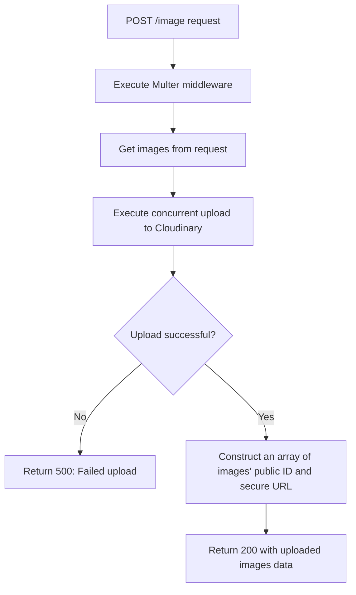
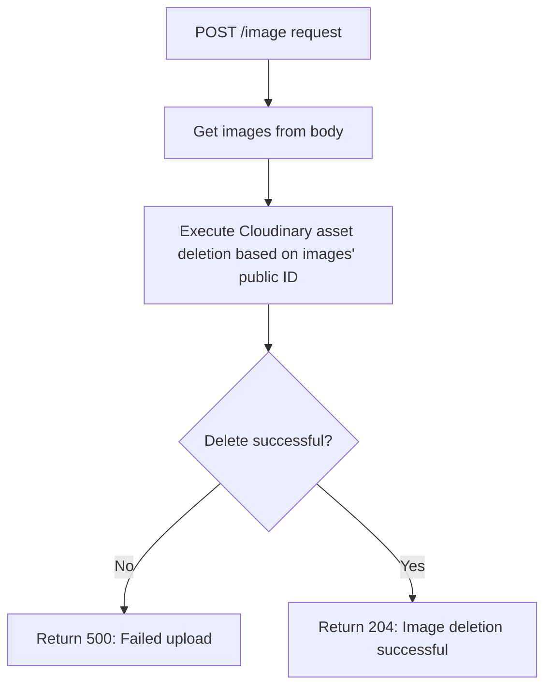

# Images Algorithm

Images algorithm designs.

---

## Upload Image

```
POST /image
```


```mermaid
flowchart TD
  imageUpload[POST /image request] --> executeMulterMiddleware[Execute Multer middleware]
  executeMulterMiddleware --> getImagesFromRequest[Get images from request]
  getImagesFromRequest --> uploadCloudinary[Execute concurrent upload to Cloudinary]

  uploadCloudinary --> isUploadSuccessful{Upload successful?}
  isUploadSuccessful -->|No| returnFailedUplaod[Return 500: Failed upload]
  isUploadSuccessful -->|Yes| constructUploadedImages[Construct an array of images' public ID and secure URL]
  constructUploadedImages --> returnSuccessfulUpload[Return 200 with uploaded images data]
```

## Delete Image

```
DELETE /image
```


```mermaid
flowchart TD
  imageUpload[POST /image request] --> getImagesFromBody[Get images from body]
  getImagesFromBody --> deleteFromCloudinary[Execute Cloudinary asset deletion based on images' public ID]

  deleteFromCloudinary --> isDeleteSuccessful{Delete successful?}
  isDeleteSuccessful -->|No| returnFailedUplaod[Return 500: Failed upload]
  isDeleteSuccessful -->|Yes| returnSuccessfulDelete[Return 204: Image deletion successful]
```
