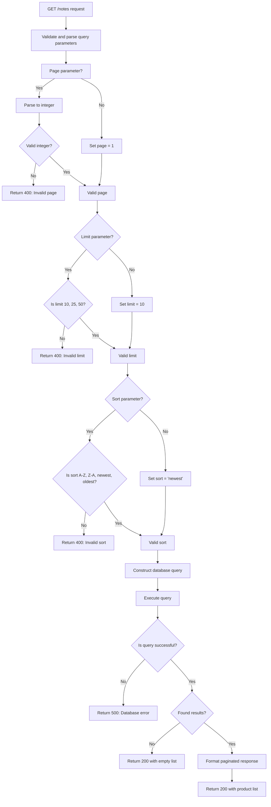

# Notes Collection

Notes collection algorithm designs.

This feature is private to each user. Therefore, all of the algorithms below assumes that the user is authorized for these actions.

---

## Get Note List

```
GET /notes
```


