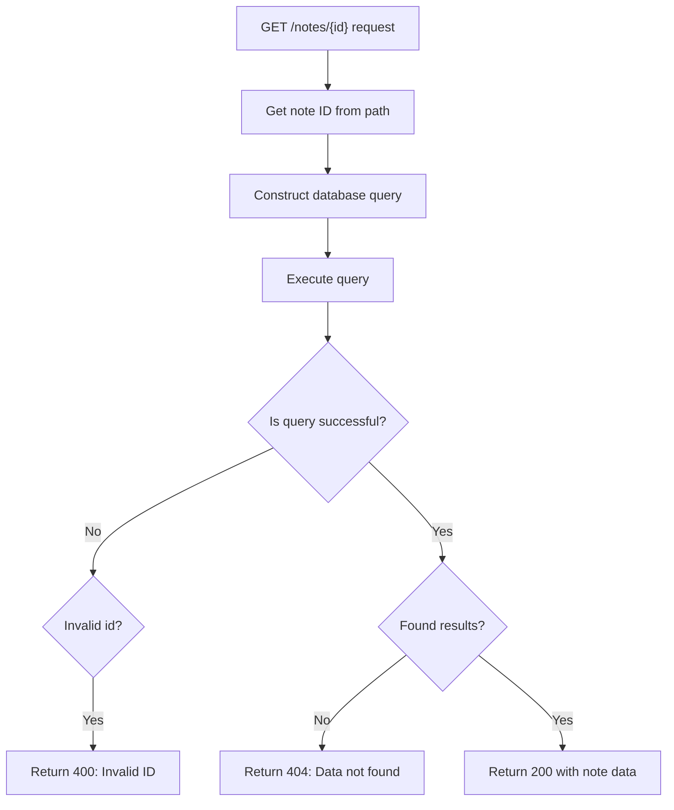
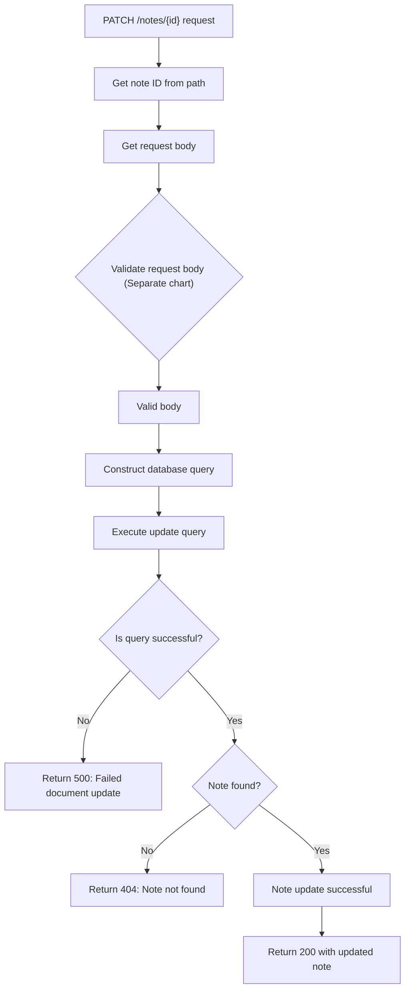
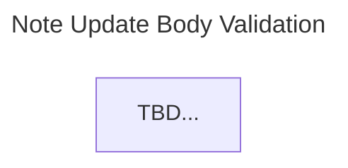
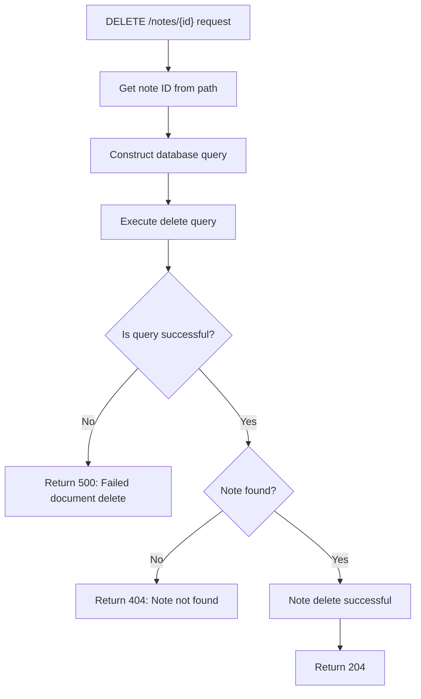

# Note Item

Note item algorithm designs.

---

## Get Note Details

```
GET /notes/{id}
```


```mermaid
flowchart TD
  getNoteDetails["GET /notes/{id} request"] --> getIdFromPath[Get note ID from path]
  getIdFromPath --> constructQuery[Construct database query]
  constructQuery --> executeQuery[Execute query]
  executeQuery --> isQuerySuccessful{Is query successful?}
  isQuerySuccessful -->|No| isIdInvalid{Invalid id?}
  isIdInvalid -->|Yes| returnInvalidId[Return 400: Invalid ID]
  isQuerySuccessful -->|Yes| isThereResults{Found results?}
  isThereResults -->|No| returnDataNotFound[Return 404: Data not found]
  isThereResults -->|Yes| returnSuccessfulResponse[Return 200 with note data]
```

## Edit Note

```
PATCH /notes/{id}
```


```mermaid
flowchart TD
  updateNote["PATCH /notes/{id} request"] --> getIdFromPath[Get note ID from path]
  getIdFromPath --> getRequestBody[Get request body]
  getRequestBody --> validateRequestBody{"Validate request body (Separate chart)"}
  validateRequestBody --> validBody[Valid body]
  validBody --> constructQuery[Construct database query]
  constructQuery --> executeQuery[Execute update query]
  executeQuery --> isQuerySuccessful{Is query successful?}
  isQuerySuccessful -->|No| returnFailedUpdateResponse[Return 500: Failed document update]
  isQuerySuccessful -->|Yes| isNoteFound{Note found?}
  isNoteFound -->|No| returnNoteNotFound[Return 404: Note not found]
  isNoteFound -->|Yes| noteUpdateSuccessful[Note update successful]
  noteUpdateSuccessful --> returnSuccessfulUpdateResponse[Return 200 with updated note]
```


```mermaid
---
title: Note Update Body Validation
---
flowchart TD
  pending[TBD...]
```

## Delete Note

```
DELETE /notes/{id}
```


```mermaid
flowchart TD
  deleteNote["DELETE /notes/{id} request"] --> getIdFromPath[Get note ID from path]
  getIdFromPath --> constructQuery[Construct database query]
  constructQuery --> executeQuery[Execute delete query]
  executeQuery --> isQuerySuccessful{Is query successful?}
  isQuerySuccessful -->|No| returnFailedDeleteResponse[Return 500: Failed document delete]
  isQuerySuccessful -->|Yes| isNoteFound{Note found?}
  isNoteFound -->|No| returnNoteNotFound[Return 404: Note not found]
  isNoteFound -->|Yes| productDeleteSuccessful[Note delete successful]
  productDeleteSuccessful --> returnSuccessfulDeleteResponse[Return 204]
```
