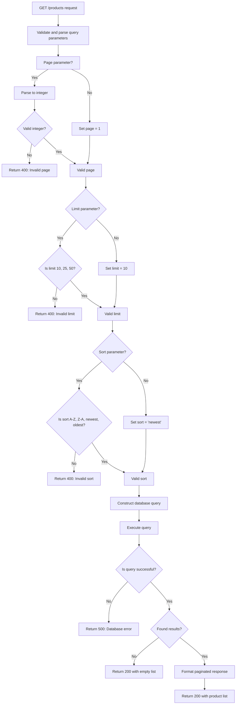
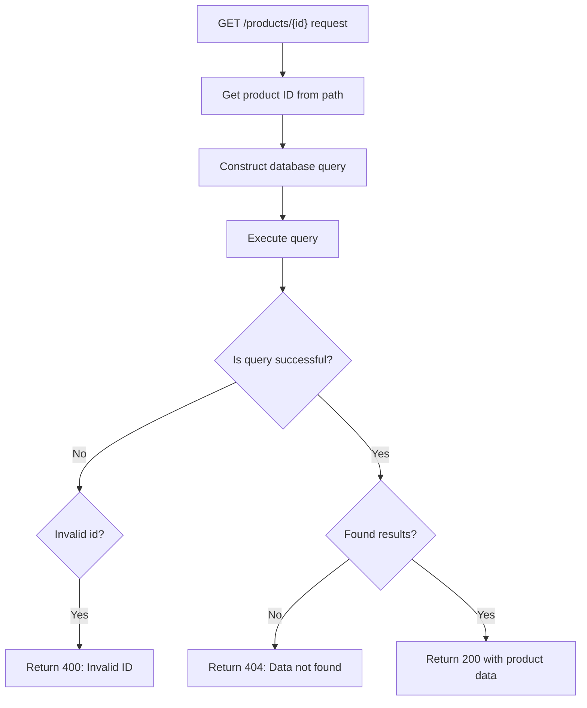
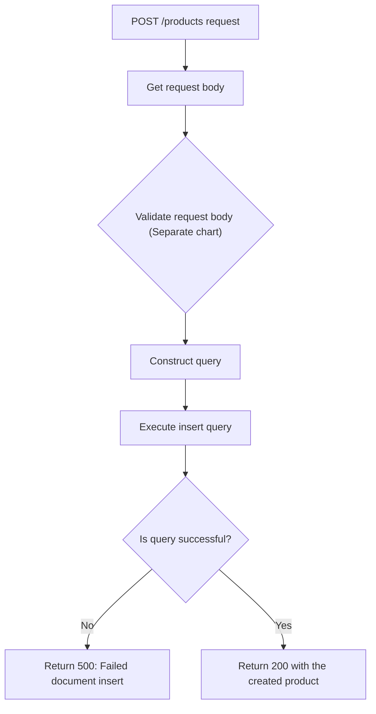
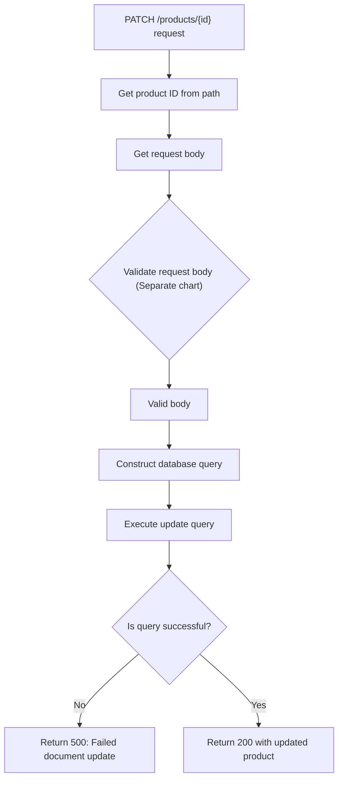
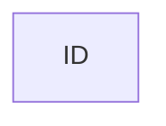
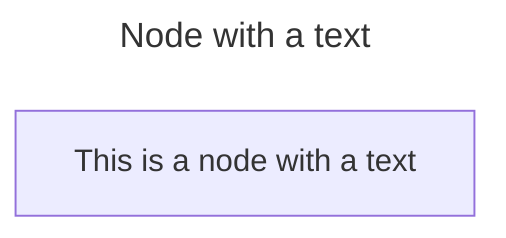
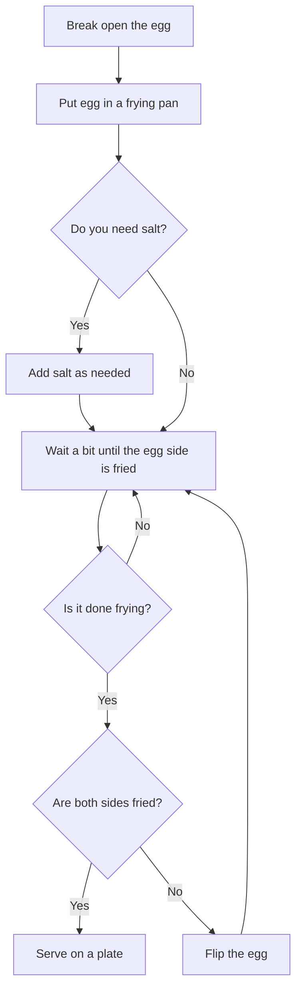

# Product Collection

Product collection algorithm designs.

---

## Get Product List

```
GET /products
```



## Get Product Details

```
GET /products/{id}
```



## Create a New Product

```
POST /products
```



## Update Product

```
PATCH /products/{id}
```



---

## Mermaid Flowchart Practice

### A Node (Default)



### A Node with a Text



---

### Frying an Egg with Salt Flowchart



