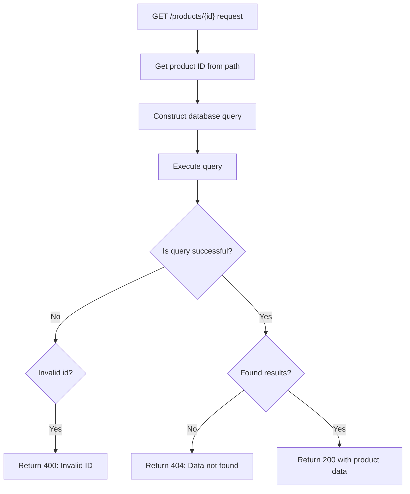
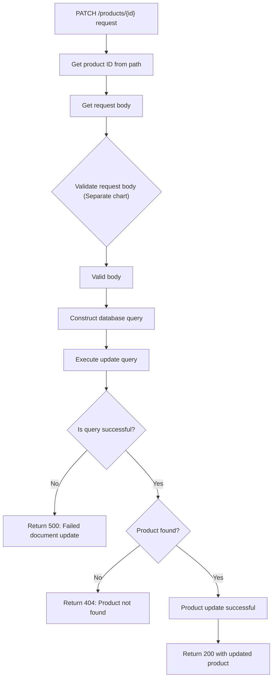
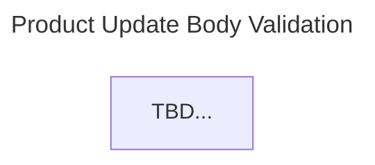
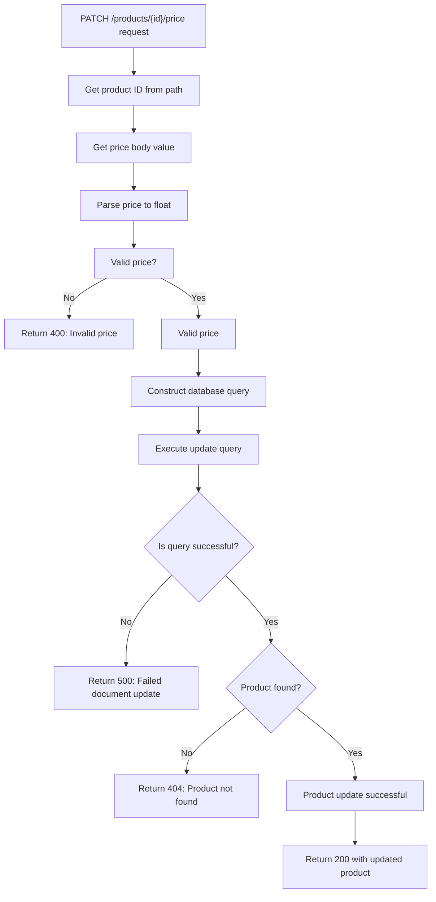
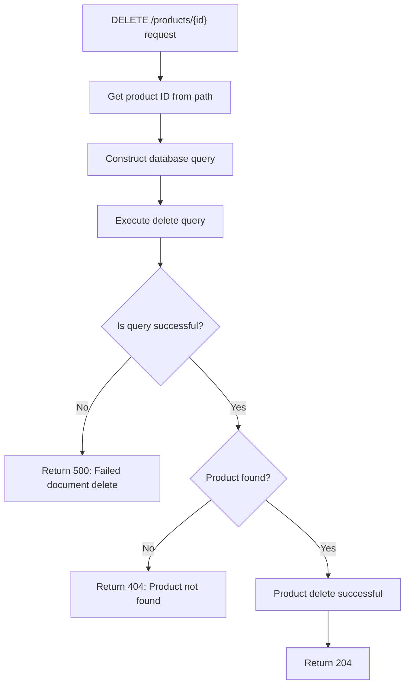

# Product Item

Product item algorithm designs.

---

## Get Product Details

```
GET /products/{id}
```



## Edit Product

```
PATCH /products/{id}
```





## Update Product Price

```
PATCH /products/{id}/price
```



## Delete Product

```
DELETE /products/{id}
```


