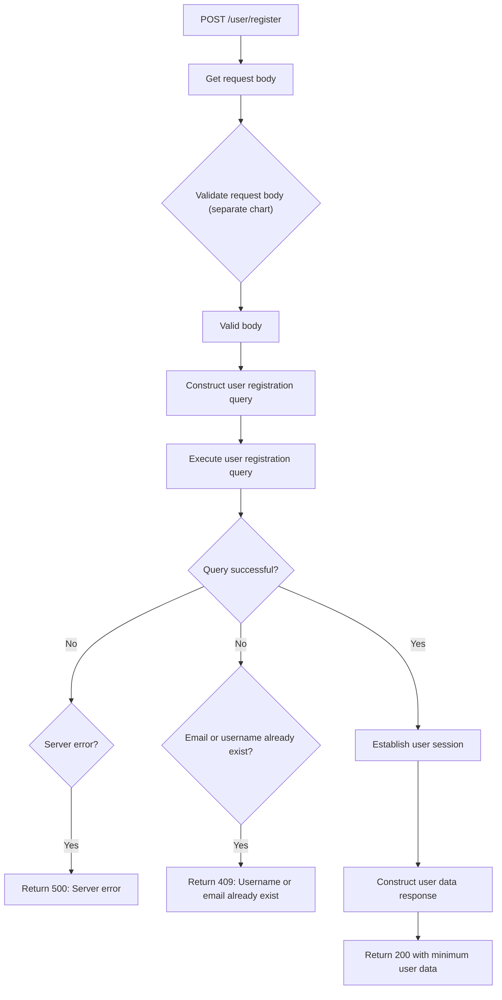
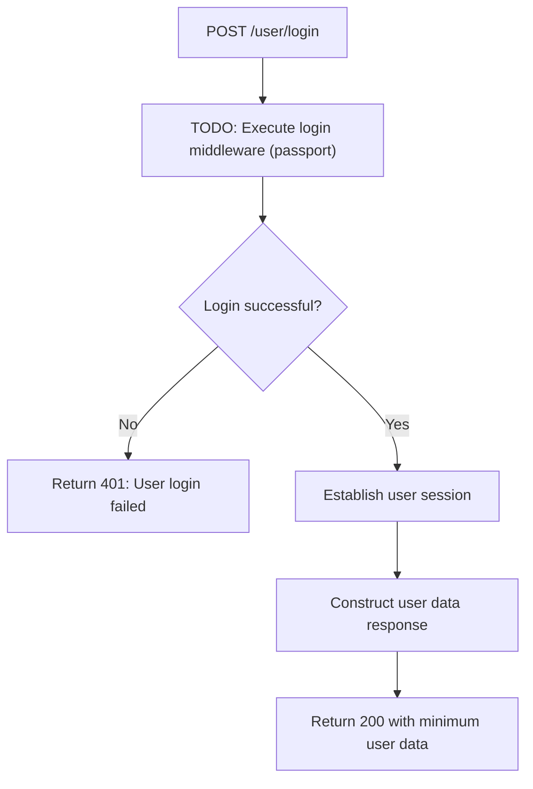
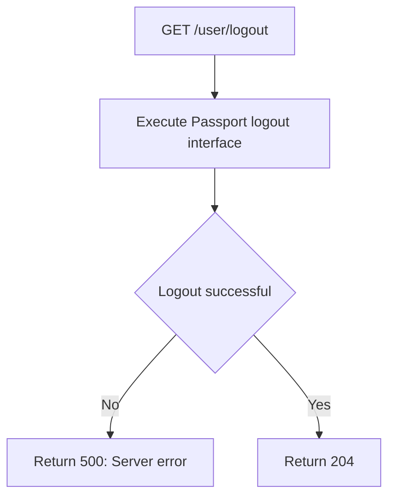
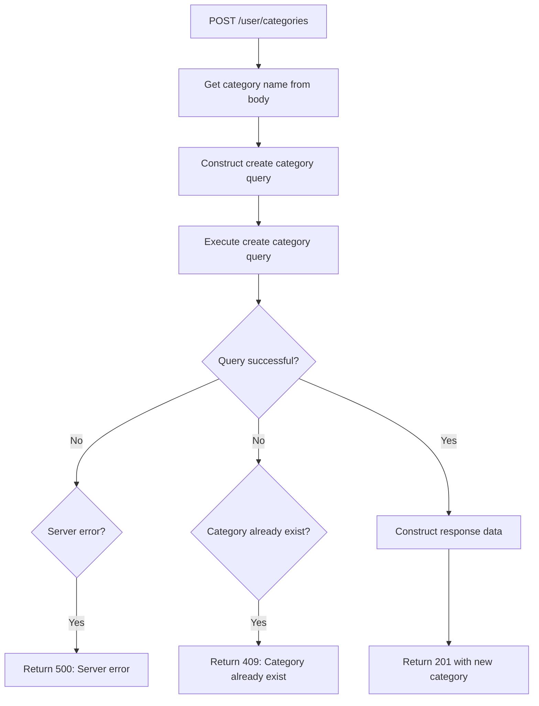
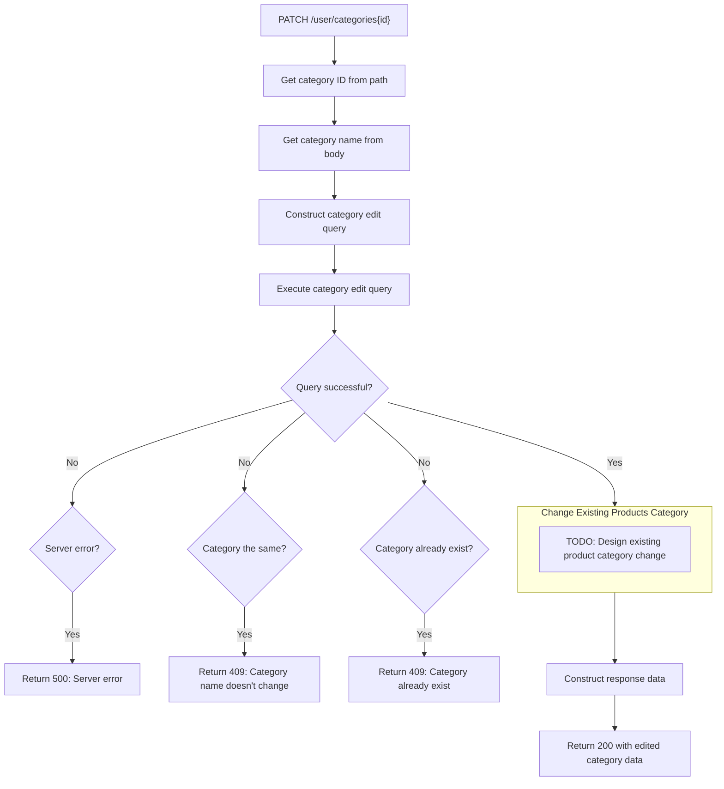

# User Algorithm

User algorithm designs.

---

## User Registration

```
POST /user/register
```



## User Login

```
POST /user/login
```



## User Logout

```
GET /user/logout
```



## Create New Category

```
POST /user/categories
```



## Edit Category

```
PATCH /user/categories{id}
```


