# User Algorithm

User algorithm designs.

---

## User Registration

```
POST /user/register
```

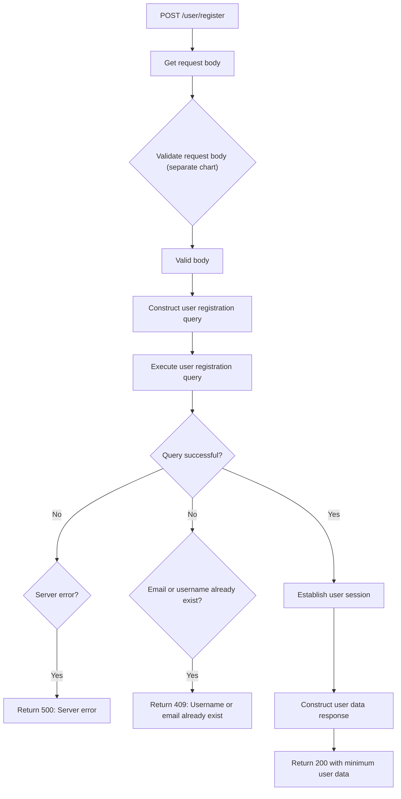

## User Login

```
POST /user/login
```

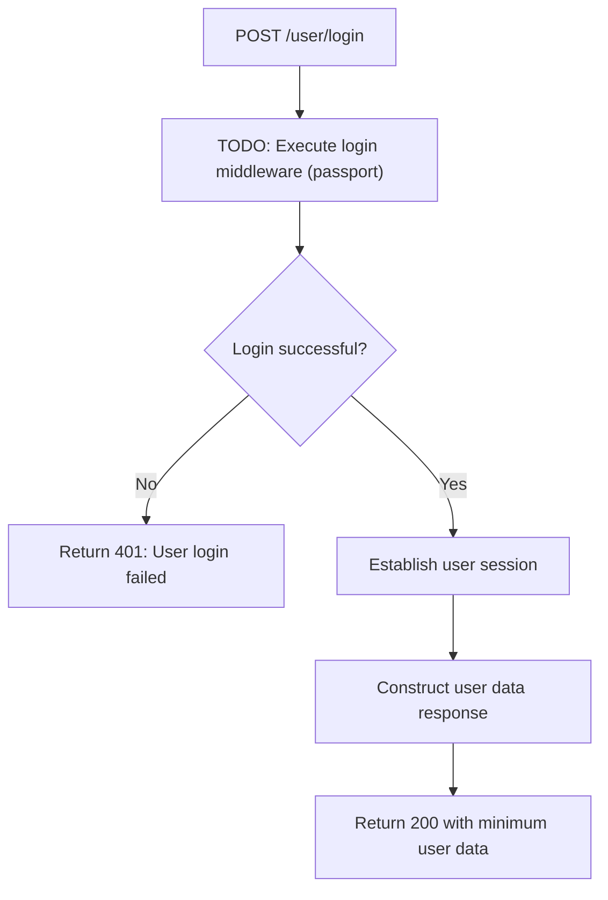

## User Logout

```
GET /user/logout
```

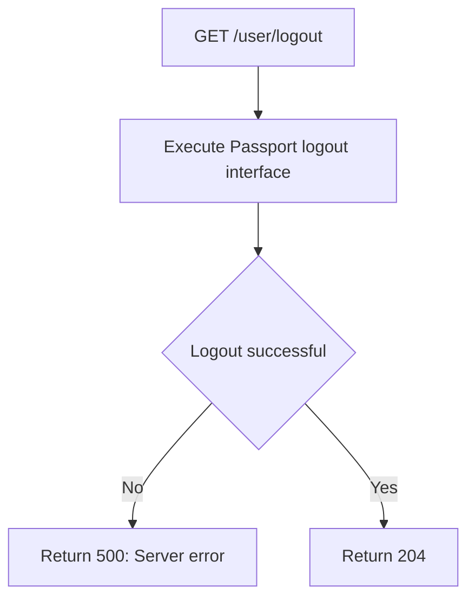

## Create New Category

```
POST /user/categories
```

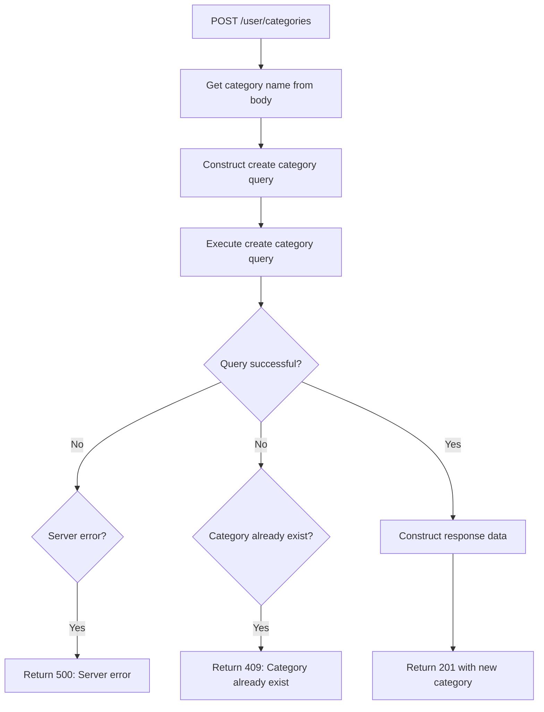

## Edit Category

```
PATCH /user/categories/{id}
```

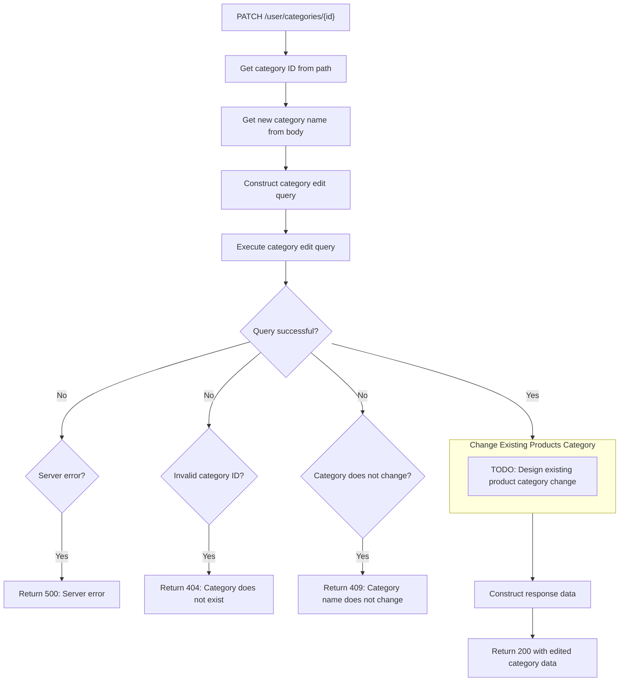

## Delete Category

```
DELETE /user/categories/{id}
```

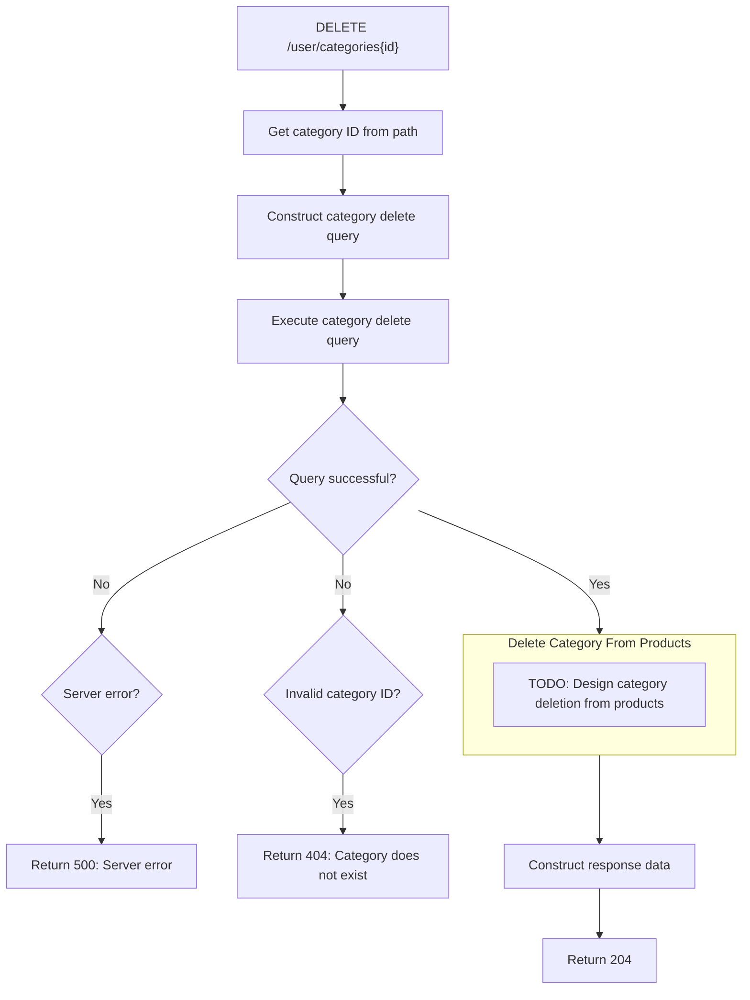

## Create New Unit Measurement

```
POST /user/unit
```

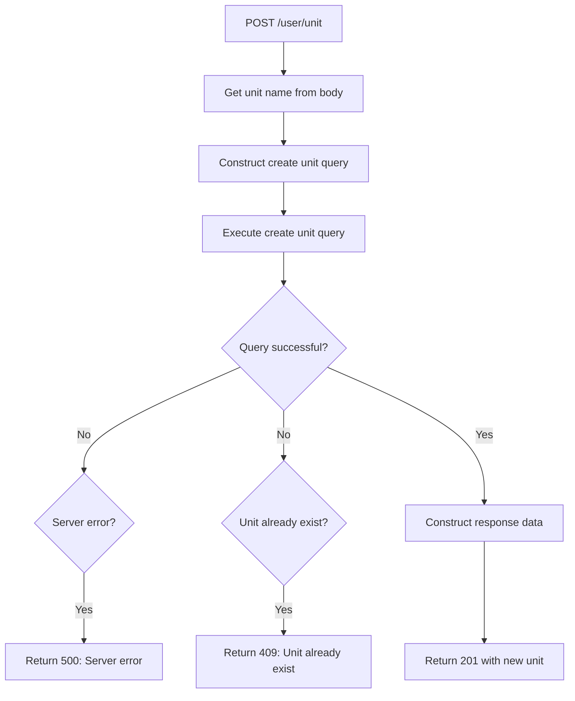

## Edit Unit Measurement

```
PATCH /user/unit/{id}
```

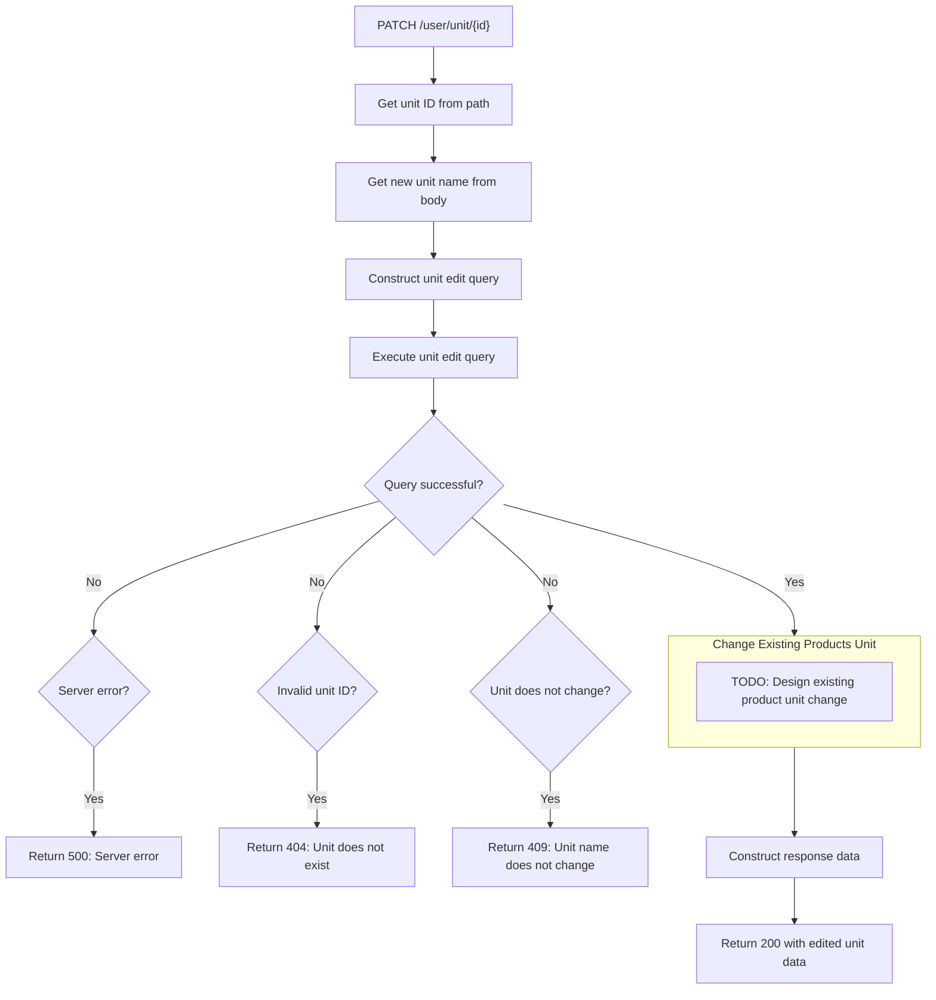

## Delete Unit Measurement

```
DELETE /user/unit/{id}
```

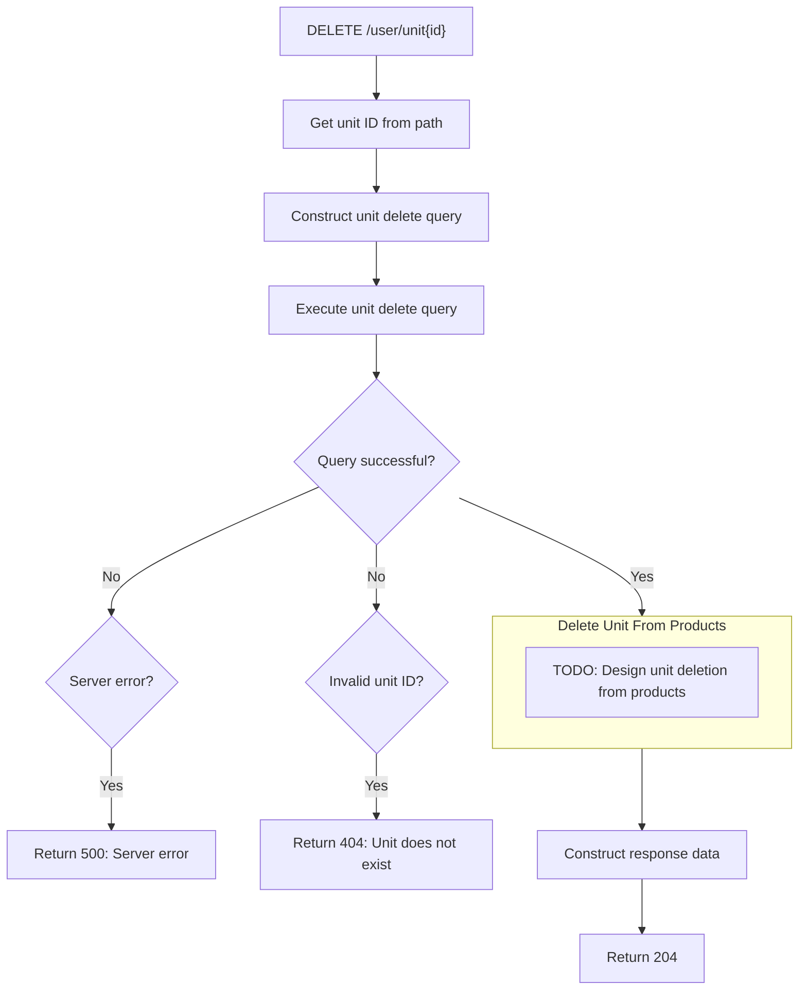

## Create New Store

```
POST /user/store
```

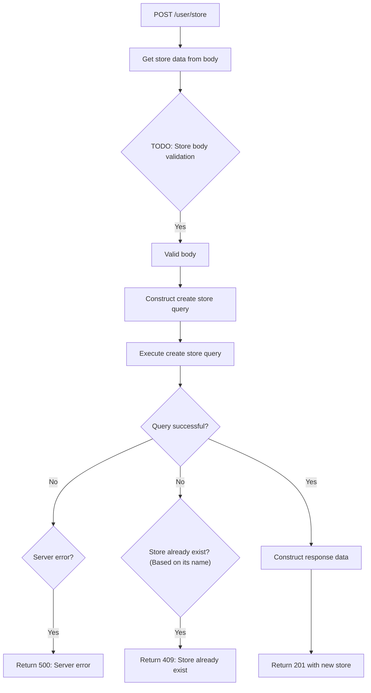

## Edit Store

```
PATCH /user/store/{id}
```

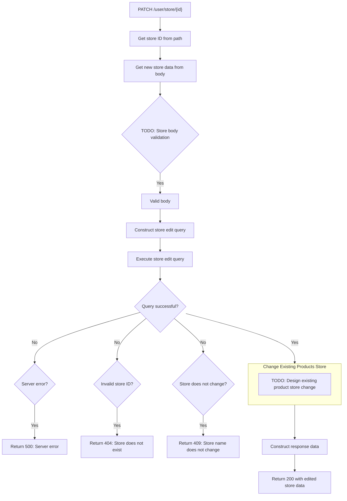

## Delete Store

```
DELETE /user/store/{id}
```

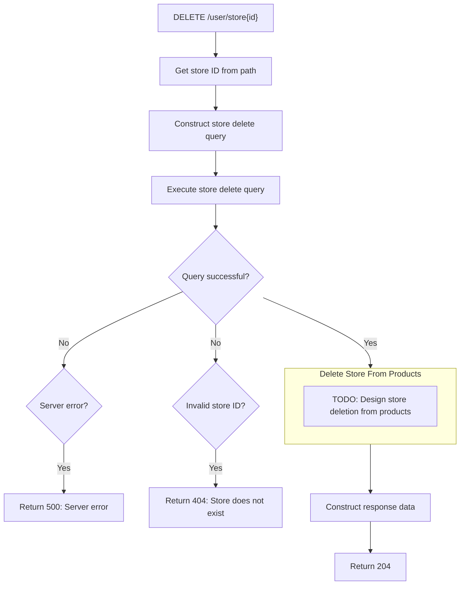
